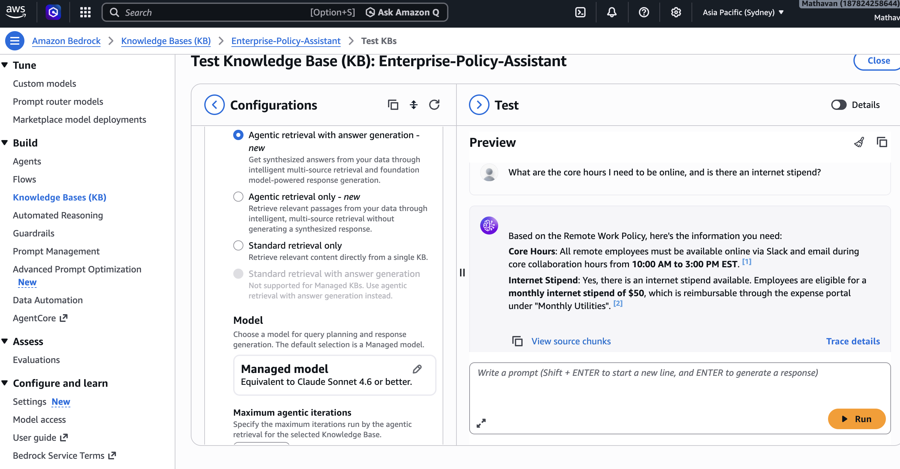
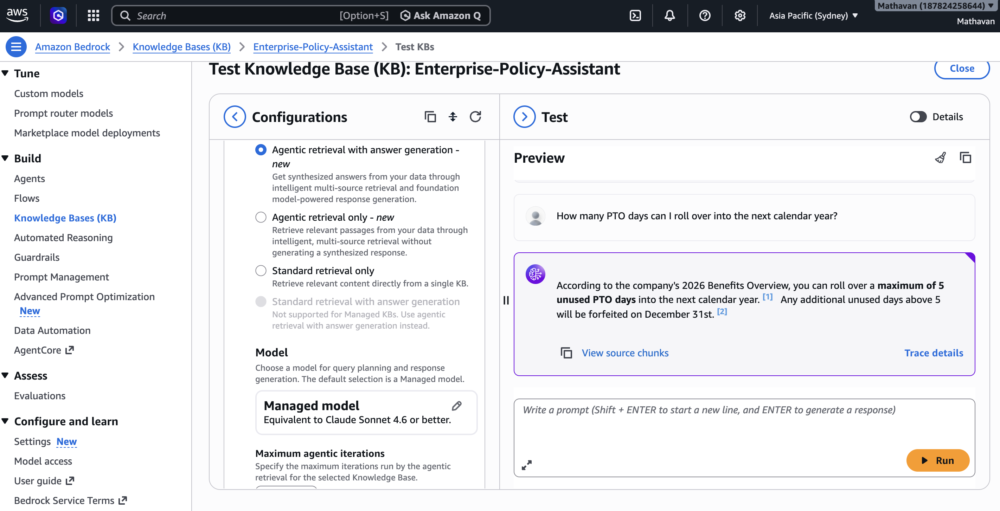

# 🤖 Enterprise Knowledge Base Chatbot (RAG Architecture on AWS)

An enterprise-grade Retrieval-Augmented Generation (RAG) chatbot designed to securely query internal corporate compliance, IT, and HR documentation. This system mitigates LLM hallucinations by restricting response generation strictly to verified data sources with exact footnote citations.

## 🏢 System Architecture

### Data & Request Flow:
1. **Data Ingestion:** Corporate text and PDF policies are uploaded securely to an **Amazon S3** bucket.
2. **Vector Pipeline:** **Amazon Bedrock Knowledge Base** pulls documents from S3, executes automated chunking, and generates numerical vector embeddings using the **Titan Embeddings G1 - Text** model.
3. **Vector Storage:** Embeddings are indexed and stored inside a high-performance **Amazon OpenSearch Serverless** collection.
4. **Retrieval & Inference:** Users query the system via the orchestration layer. The system performs a hybrid semantic/keyword search against OpenSearch, pulls the relevant document chunks, and passes them as context to **Anthropic Claude 3** to synthesize a precise, accurate answer.

---

## 🛠️ Tech Stack & Design Decisions

### **Amazon Bedrock Knowledge Base**
* **Why:** It abstracts the complex operational overhead of manually orchestrating LangChain pipelines, data syncs, and chunking strategies, providing a production-ready managed infrastructure.

### **Amazon OpenSearch Serverless**
* **Why:** Eliminates the need to provision, scale, or patch dedicated vector database clusters. It scales up or down automatically based on query volume, keeping operational costs highly efficient.

### **Anthropic Claude 3 (Haiku/Sonnet)**
* **Why:** Selected for its advanced contextual reasoning, low latency, and exceptional adherence to system prompts, ensuring the model never hallucinates beyond the provided documents.

---

## 🚀 Key Enterprise Features Implemented
* **Hybrid Search Strategy:** Combines high-accuracy semantic vector retrieval with traditional keyword searching to surface the most relevant text fragments.
* **Source Attestation:** Every response generated outputs granular citations mapping directly back to the original source chunk in S3.
* **Serverless Scale:** Designed entirely with serverless components, requiring zero server maintenance and guaranteeing high availability.

---

## 📊 Proof of Concept & Validation

Below is a demonstration of the functional RAG pipeline successfully answering compliance questions using only the ingested company policies:

*The system successfully pulled information from `hr_remote_work_policy.txt` and `benefits_summary_2026.txt` while maintaining perfect source tracking.*
